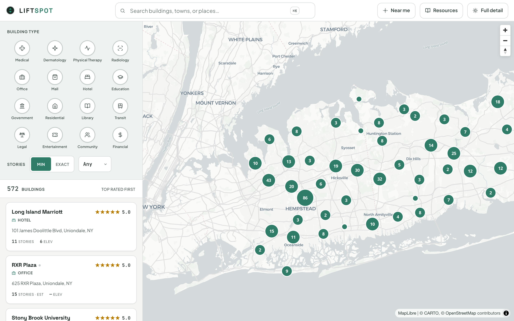
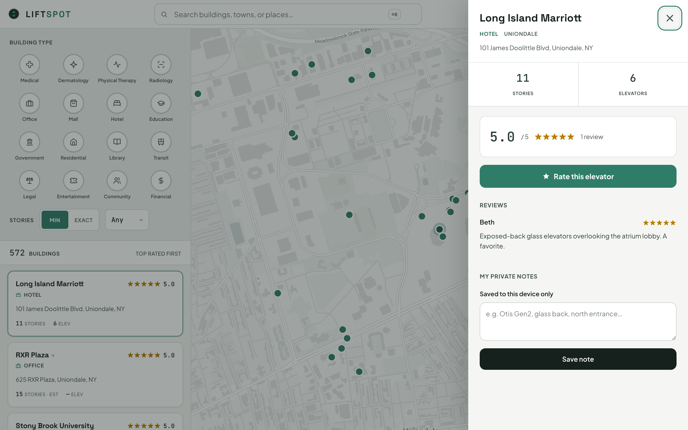
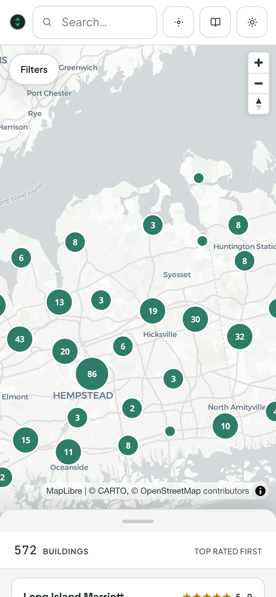
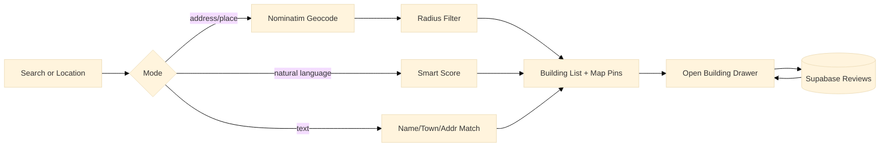

<p align="center">
  <svg xmlns="http://www.w3.org/2000/svg" width="52" height="70" viewBox="0 0 120 160"><path d="M60 0C33.49 0 12 21.49 12 48C12 76.5 60 140 60 140C60 140 108 76.5 108 48C108 21.49 86.51 0 60 0Z" fill="#1f6f5c"/><circle cx="60" cy="42" r="24" fill="white"/><rect x="44" y="30" width="14" height="24" rx="1" fill="#1f6f5c"/><rect x="62" y="30" width="14" height="24" rx="1" fill="#1f6f5c"/><path d="M60 34L54 40L66 40Z" fill="white"/><path d="M60 50L66 44L54 44Z" fill="white"/></svg>
</p>

<h1 align="center">LiftSpot</h1>

<p align="center">
  <strong>Find and rate elevators in buildings across Long Island.</strong><br />
  Search 570+ buildings, read reviews, and explore on an interactive map.
</p>

<p align="center">
  <a href="https://liftspot.netlify.app"></a>
</p>

<p align="center">
  
  
  
  
</p>

<p align="center">
  
</p>

---

My younger brother has been obsessed with elevators for over a decade.

He spends hours every day tracking down new buildings, riding every elevator he can find, and cataloguing the details most people walk straight past: the cab manufacturer, the speed, the sound of the doors. He runs **[@elevatorzboy20](https://www.youtube.com/@elevatorzboy20)** on YouTube and Instagram, where he reviews elevators with a level of care I've only ever seen from the best critics.

The problem: there was no tool built for someone like him. No map of where to go. No way to filter by building type or floor count. No place to leave a review that actually mattered.

So I built one.

**LiftSpot** is a Long Island elevator finder, built for him and for anyone else who knows that not all elevators are created equal.

---

## What it does

<table>
  <tr>
    <td width="33%" valign="top">
      <h3>Interactive Map</h3>
      <p>Every building pinned on a live MapLibre map. Click any pin to open the full detail drawer.</p>
    </td>
    <td width="33%" valign="top">
      <h3>Smart Search</h3>
      <p>Search by name, town, or natural language ("5-story hospital in Mineola"). Geocodes addresses and switches to radius mode automatically.</p>
    </td>
    <td width="33%" valign="top">
      <h3>Filter by Everything</h3>
      <p>Filter by building type (Medical, Hotel, Mall, Office, and more), minimum story count, or distance from your location.</p>
    </td>
  </tr>
  <tr>
    <td width="33%" valign="top">
      <h3>Honest Reviews</h3>
      <p>Ratings come from real submitted reviews only — never a seeded number. A building shows "No reviews yet" until someone actually rates it, then the score recalculates live.</p>
    </td>
    <td width="33%" valign="top">
      <h3>Private Notes</h3>
      <p>Save personal notes per building: cab brand, access quirks, anything. Stored locally on your device.</p>
    </td>
    <td width="33%" valign="top">
      <h3>Near Me Mode</h3>
      <p>Grant location access and get buildings sorted by distance with a radius slider (1–25 mi).</p>
    </td>
  </tr>
</table>

---

## Screenshots

<p align="center">
  
</p>

<p align="center">
  
</p>

<p align="center">
  
</p>

---

## Design

LiftSpot opens in a **calm default** — a quiet "modern cab interior" palette, low motion, and only the essentials on screen. A **Full detail** toggle reveals the denser specs view for power users. The whole interface is built to be readable and low-stimulation (it was designed with an autism-friendly default in mind), stays axe-clean across every state, honours `prefers-reduced-motion`, and works map-first on mobile with a draggable sheet.

---

## How it works



| Step | What happens |
|------|--------------|
| **Load** | All 570+ buildings fetched from Supabase on page load |
| **Search** | Query geocoded via Nominatim; if a place is found, switches to radius mode; if multi-word, runs smart keyword scoring |
| **Filter** | Type chips and story count filter applied client-side in real time |
| **Detail** | Opening a building fetches its reviews from Supabase and shows specs, notes, and a star picker |
| **Review** | New reviews inserted into Supabase; rating recalculated live from real reviews only (no reviews → "No reviews yet", never a fabricated score) |

---

## Tech stack

| Layer | Tools |
|-------|-------|
| **Frontend** | Vanilla HTML, CSS, JavaScript (zero build step) |
| **Map** | MapLibre GL 4.7, CartoDB Voyager tiles |
| **Geocoding** | Nominatim (OpenStreetMap) |
| **Database** | Supabase (PostgreSQL) |
| **Fonts** | Plus Jakarta Sans (Google Fonts) |
| **Hosting** | Netlify |

---

## Data model

```sql
buildings (id, name, type, town, addr, lat, lng, stories, elevators, rating)
reviews   (id, building_id, who, stars, body, created_at)
```

16 building types: Medical, Dermatology, Physical Therapy, Radiology, Office, Mall, Hotel, Education, Government, Residential, Library, Transit, Legal, Entertainment, Community, Financial.

---

## Data accuracy

The building catalogue was originally seeded, and seeded data lies — invented floor counts, guessed elevator counts, and a fake default rating on every row. That's being corrected, with a clear rule: **don't present a guess as a fact.**

- **Ratings** are derived from real reviews only. Buildings with no reviews show "No reviews yet" — the fabricated default scores were stripped (`migrations/001_unfake_ratings.sql`).
- **Existence & location** were audited against [OpenStreetMap](https://www.openstreetmap.org). `scripts/verify_buildings.py` looks up every building by name and location; the **108** that matched a real OSM feature near their pin are flagged `verified` (`migrations/002_add_verified.sql`). The rest could not be confirmed — some are fabricated, some are real buildings the geocoder couldn't match.
- **Unverified buildings** carry an "Unverified" badge, and their floor count is shown as an estimate (`· est`). The full per-building triage is in `scripts/verify_triage.csv`.
- **Elevator counts** have no authoritative public source, so they're shown only for verified buildings and otherwise hidden (`—`) until confirmed on a real visit.

This is an ongoing cleanup — the goal is a catalogue where every shown number is either verified or honestly marked as not.

---

## Running it locally

No install, no build step. Serve the folder with any static server (ES modules need http, not file://):

```bash
git clone https://github.com/selinmutlu06/liftspot.git
cd liftspot
python3 -m http.server 8000   # then open http://localhost:8000
```

The Supabase project is public-read, so the map and buildings load immediately.

---

## Project structure

```
index.html          # Markup + CDN links
css/tokens.css      # Design tokens — "modern cab interior" palette, type, spacing
css/app.css         # All component styles
js/data.js          # Supabase client, state, filtering, smart search scoring
js/map.js           # MapLibre init, clustering, elevator-button pins
js/search.js        # Command palette (Cmd-K), geocode cache + rate limit
js/drawer.js        # Building detail, door-reveal animation, reviews, notes
js/ui.js            # Entry module: filters, list, toasts, wiring
schema.sql          # Supabase table definitions and RLS policies
seed_more*.sql      # Building seed data
migrations/         # Incremental SQL changes — run in the Supabase SQL editor
scripts/            # Data tooling — OpenStreetMap verification audit
docs/               # README assets + redesign plan
```

---

<p align="center">
  <a href="https://www.youtube.com/@elevatorzboy20">YouTube</a> · <a href="https://www.instagram.com/elevatorzboy20">Instagram</a>
</p>

<p align="center">
  <sub>MIT License</sub>
</p>
